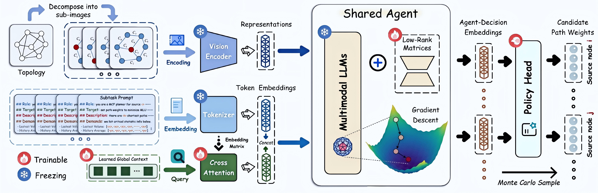

# Divide, Harmonize, Then Conquer It: Shooting Multi-Commodity Flow Problems with Multimodal Language Models <br><sub>Official PyTorch Implementation</sub>

<p align="center">
    <a href= "https://github.com/Y-debug-sys/Pram/stargazers/">
        </a>
    <a href= "https://github.com/Y-debug-sys/Pram/network/">
        </a>
    <a href= "https://pytorch.org/">
        </a>
    <a href= "https://huggingface.co/Qwen/">
        </a>
    <a href= "https://www.python.org/downloads/release/python-31019/">
        </a>
    <a href= "https://github.com/Y-debug-sys/Pram/blob/master/LICENSE">
        </a>
</p>

<p align="center"></p>

> 👉 [**Pram**](https://openreview.net/pdf?id=kL9nYFvs6O) is a multimodal language model (MLM)-powered framework for solving multi-commodity flow (MCF) problems, accepted by [`ICLR '26`](https://infocom2026.ieee-infocom.org/). By leveraging the mathematical reasoning ability of MLMs, Pram achieves near-optimal flow allocations while outperforming production-grade LP solvers by several orders of magnitude in speed.

--- 

## 🔬 Overview

As shown in Figure 1, Pram consists of the following three main parts (from left to right). **(i) 🧩 Divider:** Complex problems are often intractable as a whole but can be decomposed into subproblems defined over subsets of commodities and links. **(ii) 🧠 Solver:** We propose to fine-ture MLMs (e.g., Qwen2.5-VL) for solving these subproblems in parallel, exploiting their mathematical reasoning capacity to yield high-quality allocations. **(iii) ✨ Harmonizer:** We adopt multi-agent reinforcement learning (MARL) algorithms, i.e., counterfactual reasoning, to learn coordinated policies. 

<p align="center">

<br>
<b>Figure 1:</b> Overview of Our Proposal, Pram.
</p>

## 🗂️ Code Structure

```
./Pram-master
├── 📁 baselines                       # Baseline methods for comparison
├── 📁 data                            # Dataset construction and loading
│   ├── 📁 demand                      # Demand matrices
│   ├── 📁 topology                    # Network topologies
│   ├── 📄 build_dataloader.py         # Build PyTorch dataloaders
│   └── 📄 dataset.py                  # Dataset and preprocessing logic
├── 📁 env                             # Experimental environment 
│   ├── 📄 logger.py                   # Logging utilities
│   ├── 📄 marl_env.py                 # Reinforcement learning environment
│   └── 📄 objective.py                # Objectives (e.g., MLU, total flow)
├── 📁 mlms                            # Pretrained MLM weights
├── 📁 pram                            # Core implementation of Pram
│   ├── 📁 modules                     # Neural network modules
│   ├── 📄 divider.py                  # Commodity partitioning and plotting logic
│   ├── 📄 solver.py                   # Problem solver for training / evaluation
│   ├── 📄 model_qwen.py               # Qwen-VL-based backbone model
│   ├── 📄 prompt.py                   # Prompt templates and construction logic
│   └── ...
├── 📁 scripts                         # Scripts (.sh)
├── 📁 utils                           # Useful functions
├── 📄 ds_config_zero2.json            # DeepSpeed configuration file
└── 📄 main.py                         # Main entry point
```

## 🧑‍💻 How to run

### 1. Install dependencies

- Run `pip install -r requirements.txt` to install all Python dependencies.  
- 📌 [Miniconda](https://docs.anaconda.com/free/anaconda/install/index.html) or [Anaconda](https://docs.anaconda.com/free/anaconda/install/index.html) is required.  
- 🔑 Acquire a Gurobi license from [Gurobi](https://www.gurobi.com/solutions/licensing/) and activate it with `grbgetkey [gurobi-license]`

### 2. Prepare datasets

For reproducibility, **all topologies and demand matrices used in our experiments are included in the supplementary material** of our [OpenReview submission](https://openreview.net/forum?id=kL9nYFvs6O). For convenience, we also host the same data on [Google Drive](https://drive.google.com/file/d/1adj4cy43NOTEuzslZ1K4iRLvEsoVGFVQ/view?usp=sharing). After downloading the archive, please unzip it and place the files into the corresponding directories: [topology](./data/topology/) for topology files and and [demand](./data/demand/) for demand matrices.

> 🔔 Note: Real-world network topologies are provided in JSON format and are accompanied by their corresponding traffic demand matrices. In contrast, large-scale topologies from Topology Zoo are represented in GraphML format and do not include predefined demand matrices; therefore, their traffic demands are synthetically generated following the procedures implemented in our codebase

### 3. Prepare models

We adopt several open-source instruction-tuned vision–language models from [ModelScope](https://modelscope.cn) as the backbone reasoning engines in our framework. You can download them with the following commands:

```bash
# 🦄 Qwen2.5-VL-7B-Instruct
modelscope download --model qwen/Qwen2.5-VL-7B-Instruct --local_dir ./mlms/Qwen2.5-VL-7B-Instruct

# 🐼 Qwen2.5-VL-3B-Instruct
modelscope download --model qwen/Qwen2.5-VL-3B-Instruct --local_dir ./mlms/Qwen2.5-VL-3B-Instruct

# 🦙 Llama-3.2-11B-Vision-Instruct
modelscope download --model llama/Llama-3.2-11B-Vision-Instruct --local_dir ./mlms/Llama-3.2-11B-Vision-Instruct
```

Or load directly in Python:

```python
from modelscope import snapshot_download

# Example: Qwen2.5-VL-7B-Instruct
model_dir = snapshot_download("qwen/Qwen2.5-VL-7B-Instruct")
```

### 4. Run Pram

Run the provided script to evaluate **Pram** on the **GÉANT topology**:

```bash
(base) $ conda activate myenv
(myenv) $ cd Pram-master
(myenv) $ bash scripts/test.sh
```

The script will automatically load the corresponding topology and demand matrices, and then execute **Pram** with default settings. Logs and results will be saved in the `./log` directory by default. To evaluate **Pram** on other topologies, please modify the [config](./pram/helper.py) and rerun the script.

### 🖥️ Hardware requirements

- 🐧 Linux OS (tested on Ubuntu)  
- 🧮 CPU instance with multiple cores  
- 💻 GPU instances with **sufficient memory** and CUDA installed 

### 5. Run Baselines

We provide implementations of multiple baseline methods, i.e., LP, POP, LP-top, HARP, Ather, and PPO, used in our experimental evaluation.  
⚡ See the [`baselines`](./baselines) directory for more details on usage and setup. For example, to run the linear programming, you can run the following command:

```bash
(base) $ conda activate myenv
(myenv) $ python -m baselines.LP.run
```

## 🧾 License

This repository is released under the MIT License. See the [LICENSE](https://github.com/Y-debug-sys/Pram/blob/master/LICENSE) file for details.

## 📚 Citation

Please consider citing our papers if you think the codebase is helpful to your research.

```bibtex
@inproceedings{yuan2026divide,
  title={Divide, Harmonize, Then Conquer It: Shooting Multi-Commodity Flow Problems with Multimodal Language Models},
  author={Xinyu Yuan and Yan Qiao and Zonghui Wang and Wenzhi Chen},
  booktitle={The Fourteenth International Conference on Learning Representations},
  year={2026},
  url={https://openreview.net/forum?id=kL9nYFvs6O}
}

@article{yuan2026putting,
  title={LMTE: Putting the ``Reasoning'' into WAN Traffic Engineering with Language Models},
  author={Yuan, Xinyu and Qiao, Yan and Wang, Zonghui and Li, Meng and Chen, Wenzhi},
  journal={arXiv preprint arXiv:2602.00941},
  year={2026}
}
```

## 🤝 Acknowledgments

We acknowledge the open-source community for providing the foundational tools and libraries that this work relies on.
Their contributions were instrumental in enabling the implementation and evaluation of Pram. Here we list them as follows:

- [**NCFlow**](https://www.usenix.org/conference/nsdi21/presentation/abuzaid) - https://github.com/netcontract/ncflow - [*License*]()
- [**POP**](https://dl.acm.org/doi/abs/10.1145/3477132.3483588) - https://github.com/stanford-futuredata/POP - [*License*](https://github.com/stanford-futuredata/POP/blob/main/LICENSE)
- [**Traffic-Matrix-Prediction**](https://ieeexplore.ieee.org/document/8969631) - https://github.com/THU-INSC-NAD/Traffic-Matrix-Prediction - [*License*]()
- [**DOTE**](https://www.usenix.org/conference/nsdi23/presentation/perry) - https://github.com/PredWanTE/DOTE - [*License*]()
- [**Teal**](https://dl.acm.org/doi/10.1145/3603269.3604857) - https://github.com/harvard-cns/teal - [*License*](https://github.com/harvard-cns/teal/blob/main/LICENSE)
- [**FIGRET**](https://dl.acm.org/doi/10.1145/3651890.3672258) - https://github.com/FIGRET/figret - [*License*](https://github.com/FIGRET/figret/blob/main/LICENSE)

## 👤 Contact

If you have any questions or comments, please feel free to contact [Xinyu Yuan](mailto:yxy5315@gmail.com) (yxy5315@gmail.com) or [open an issue](https://github.com/Y-debug-sys/Pram/issues/new) on this repository.

## 💬 Quick questions

1. **Why are some sub-topologies displayed in a blurred or cluttered manner ?**  
We partition the original topology into multiple smaller subgraphs for visualization. However, the current plotting parameters are tuned for topologies with a relatively small number of nodes. When applied to larger-scale topologies, the visualization may appear blurred or cluttered. In such cases, the plotting parameters (e.g., layout scale, node size, and figure resolution) should be adjusted accordingly based on the topology size.

2. **Does this repository include implementations for Llama-based models and post-tuning ?**  
his repository primarily focuses on the *core operations and workflow of Pram based on Qwen models*. Implementations related to *Llama-based models* and *post-tuning procedures* are not the main focus of this codebase. That said, we highlight important considerations and implementation notes in `model_llama.py`. In addition, the post-tuning components can be found in the following external repositories, which we reference for completeness.   1️⃣ [*Running gradient descent with ADMM*](https://github.com/harvard-cns/teal) - 2️⃣ [*Recurrent adjustment with RNNs*](https://github.com/Purdue-ISL/HARP) - 3️⃣ [*LP-based partial solution refinement*](https://github.com/netlab-lcy/LO-TE).

3. **To be continued ...**  

